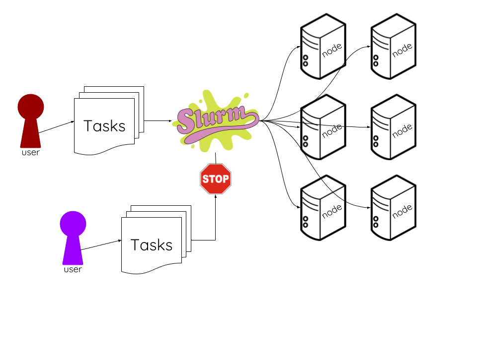

<script type="text/javascript">
$(document).ready(function(){
  // for every article tag inside a slide tag
  $("slide > article").each(function(){
    // copy the article name to the parentNode's (the slide) ID
    this.parentNode.id=$(this).attr('name');
  });
});
</script>

## It's highly addictive! {.SlideClass #SlideID name=Fry}


## What is this talk about?
* Very simple implementation of Slurm in R on Exacloud. 
* No details on tuning Slurm--we're sticking to default settings. 
* Focus on embarrassingly parallel tasks only.
* It's a simple demo of the <tt>**rslurm**</tt> package, which makes slurmming it in R easy. 

Details:

https://cran.r-project.org/web/packages/rslurm/vignettes/rslurm.html

## What is Slurm?


## Embarrassing parallel tasks
* No effort to split the processing among multiple processors
* No need to communicate or share results between tasks

**Embarrassing:** Have 10 nodes simulate 1000 datasets, run a single linear model on each dataset, and report the p-value for the first independent variable in each model.

**Less embarrassing:** Have 10 nodes simulate 1000 datasets, with the parameters of each dataset refined based on a summary of the previous dataset.

<!-- ## Embarrassing examples -->
<!-- * Have 20 babboons make 100 sandwiches using 100 slices of meat, 100 slices of tomato, and 200 slices of bread. -->
<!-- * Have 5 squirrels pack 100 lunches using the 100 sandwiches made by babboons -->
<!-- * Have 10 nodes simulate 1000 datasets, run a single linear model on each dataset, and report the p-value for the first independent variable in each model. -->

<!-- ## Less embarrassing examples -->
<!-- * Have 20 babboons make 100 sandwiches without using the same kind of meat in more than 10 sandwiches.  -->
<!-- * Have 5 squirrels pack 100 lunches, cutting the crust off of each sandwich only if all the other squirrels were able to resist taking a bite while packing the concurrent lunches. -->
<!-- * Have 10 nodes simulate 1000 datasets, with the parameters of each dataset refined based on a summary of the previous dataset. -->

# The exacloud environment

## Connecting to exacloud
**On a PC:** http://www.putty.org/

**On a Mac:** ⌘-space > Terminal

<br><br>
**Secure shell:**
<div style="background-color: #000000; color:lightgreen;">
```
$ ssh exahead1.ohsu.edu
```
</div>

## Setting up the environment
* I had to install packages and dependencies one at a time. 
* <tt>install.packages("tidyverse")</tt> has never worked for me on Exacloud. I would welcome insights into this problem. 

## Directories to use
* For running parallelized scripts, put your data in <tt>/home/exacloud/lustre1/biostat/hartky</tt>.<span style="color:red;">*</span>
* Can also store your script on lustre, or you can put it in your home directory (<tt>/home/users/hartky</tt><span style="color:red;">*</span>)

<div class="footer">
\* If you are not <tt>**hartky**</tt>, replace that part with your own user name.
</div>

## Directories not to use
* Don't store your data on lustre when you're done with it. I put mine in <tt>/home/groups/biostats/hartky</tt><span style="color:red;">*</span>, but I don't know if that's the right thing to do. 
    + Discuss!
* Don't put any data in <tt>/home/users/hartky</tt><span style="color:red;">*</span> at any time. 
    + Doing so upsets the admins. 

<div class="footer">
\* If you are not <tt>**hartky**</tt>, replace that part with your own user name.
</div>

## Partitions
**Default:** Exacloud. All nodes except GPU. Time Limit: 36 hours. Preempt Action: Requeue. 

**mpi:** Infiniband-connected nodes. Time Limit: 14 days. Preempt Action: Requeue. 

**gpu:** GPU nodes. Time Limit: 14 days. Preempt Action: Requeue. 

**long_jobs:** 10gbps ethernet nodes. Time Limit: 10 days. Preempt Action: Requeue. Limits: 60 jobs running.

**very_long_jobs:** 10gbps ethernet nodes. Time Limit: 30 days. Preempt Action: Suspend.

# R package rslurm

## Motivating example
Fry, Leela, Bender, Zoidberg, and Amy deliver a lot of packages to the Alpha Centauri system. Leela and Fry have gotten into an argument about who is the better pilot and can deliver packages more quickly. To settle the dispute, we would like to conduct an RCT where each delivery is randomized to be piloted by either Fry or Leela. Professor Farnsworth is designing the study, and he thinks Leela gets the packages to Alpha Centauri on average 20 minutes faster than Fry. How many observations of deliveries do we need to have 80% power to detect a difference of 20 minutes in delivery time between the two pilots? 


## Sample size
$H_1: \mu_1 - \mu_0 \ne 0$

If we set $\mu_0 = 240$, $\mu_1 = 220$, $\sigma_0 = \sigma_1 = 20$, and $n_1 = n_2$, we can solve for $n$ easily:

$$
\begin{align*}
n_1 = n_2 &= \frac{2\sigma^2(z_{1-\alpha/2} + z_{1-\beta})^2}{\mu_1 - \mu_0} \\[0.2in]
 &= \frac{2(20^2)(1.960 + 0.842)^2}{240 - 220} \\[0.2in]
 &\approx 16
\end{align*}
$$

## Sample size
$H_1: \mu_1 - \mu_0 \ne 0$

Could also use the black box:


```r
power.t.test(delta=20, sd=20, power=0.8)
```

```
## 
##      Two-sample t test power calculation 
## 
##               n = 16.71477
##           delta = 20
##              sd = 20
##       sig.level = 0.05
##           power = 0.8
##     alternative = two.sided
## 
## NOTE: n is number in *each* group
```

## Simulation
But let's pretend we want to use simulation instead. 

Generate a dataset; start with sample size $n = 10$:


```r
n <- 10
(sim_df <- tibble(x = c(rep(0, n/2), rep(1, n/2)),
                  y = 240 - (20 * x) + rnorm(n=n, mean=0, sd=20)))
```

```
## # A tibble: 10 x 2
##        x        y
##    <dbl>    <dbl>
##  1     0 227.5390
##  2     0 263.0122
##  3     0 245.2342
##  4     0 224.8448
##  5     0 219.1766
##  6     1 235.3668
##  7     1 213.7075
##  8     1 215.1101
##  9     1 215.2433
## 10     1 213.7202
```

## Simulation

```r
t.test(y ~ x, data=sim_df)
```

```
## 
## 	Welch Two Sample t-test
## 
## data:  y by x
## t = 1.9103, df = 6.0279, p-value = 0.1044
## alternative hypothesis: true difference in means is not equal to 0
## 95 percent confidence interval:
##  -4.843523 39.507126
## sample estimates:
## mean in group 0 mean in group 1 
##        235.9614        218.6296
```


It isn't significant at $\alpha=0.05$. 

## Simulation

Record results:

```r
sig_tests <- list(n_10 = c(0),
                  n_11 = c(),
                  n_12 = c(),
                  n_13 = c())
```

Repeat 100 times:


```
## $n_10
##   [1] 0 1 1 0 1 1 1 0 0 0 0 1 0 1 1 1 0 0 0 0 1 0 0 1 1 1 0 0 0 0 0 1 0 1 0
##  [36] 0 1 1 0 0 0 1 0 1 0 1 0 0 1 0 0 1 1 1 0 1 1 0 1 0 1 0 1 0 1 0 0 1 0 1
##  [71] 1 1 1 0 1 0 1 0 1 1 0 0 1 0 1 1 0 1 0 0 1 0 0 1 1 1 0 0 0 0 0
## 
## $n_11
## NULL
## 
## $n_12
## NULL
## 
## $n_13
## NULL
```

## Simulation

Solve for power:

```r
sum(sig_tests$n_10) / length(sig_tests$n_10)
```

```
## [1] 0.4653465
```

Increment $n$ by 2 and start over. Repeat until power $\ge 0.80$.

## Functionalize

```r
run_sim <- function(n) {
  sim_df <- tibble(x = c(rep(0, n/2), rep(1, n/2)),
                   y = 240 - (20 * x) + rnorm(n=n, mean=0, sd=20))
  result <- t.test(sim_df$y ~ sim_df$x)
  significant <- ifelse(result$p.value < 0.05, 
                        yes = 1,
                        no = 0)
  return(as.integer(significant))
}

run_sim(10)
```

```
## [1] 0
```

## Purrr {.SlideClass #SlideID name=purrr}
<style type="text/css">
#purrr {
background-image: url(data:image/png;base64,iVBORw0KGgoAAAANSUhEUgAAA4QAAAK8CAMAAACAzoF9AAAC/VBMVEUAAAAAAAAAAAABAQEAAAAAAAAAAAAAAAAAAABiZF8bJg0CAgIAAAAAAAADAwMdKQ4dKA4AAAADAwNcYlUcKA0vOSJqcGQyOyUAAAB2eHMoKCdKUT9CSjgcKA5WWVIAAABLTEpkZWJKUkFMTko0PigAAABBQkB0eW9ydW0bJw0ZGRkdKQ7o7/Dr7/Pq7vHn7fDr8PPo7vHn7/Dq7/Lp7uzq7e7t8vXp7fDl6uzs8vTn7O/n7u/r8vPp7PDo6+/l7O/j6evt8vXl6uvn6+7v9ffu9fbp7u7w9vno7e/j6uzt8vPr7/Lo7Ozp7e3o7u/m7vHl7O3o7e7n6uvo7evq7Ovn6u3q8fHj6Oru8/bl6u7r7u/t8O7q7vDu8/Tr7/Dr7+vl6ejo7ejr7/Dl6eXs7vHj6Obs8PLr7u3m6+jh6Ork7O3q7Oji5uTx9ffx9fbh5ujn6+by+Pro6+np8fPa3+Hm7Ozp6+3p7unv8/br8ezt8vLs8PTd4eDi5uHj5+fb4Nvn6ebr7+7r7PDm6OPt7+vT2Njg4+Hf5eje4+T2+vzj6OPh5Obg5uD5/P3u8u3c4uTq7u/m5+nU2NPQ1tXW29t0eG3v8vHN0tLe4972+fnX3d+7wLrZ3d2epJvz9/hSW0nR1M9GUT1nbF/w9PLk5uNcY1nZ3dmzuLJaX1Cqr6ianpZFRz1uc2okMBa7wcEgKxLW29YEBwh6g3bJzs53fXPEysmVmpHN0MtjaFyFioE+STSpr7Dg4t3Dx8WlqqM7QUQSFhWSlo1eaGzw9O/z9/SOk4lMUEvJy8avs65QVEPp8PC3vLY1PihrdHd9fnVhYVQTHykgMTzs9PU4RC18hIevtri2vL6Cio2ChXtXV0mcpKajpp+KjIUsNx+JkYZ2fYFrcGIjKzBLVVsrO0XAxcIpLCN+hXscHxQoMxpGUFaTmpzAw746PDVlbnEuMjEwOiQ5SFCLlJVWWVSYn6Gkq65weH1MTkBWYmdAQzIfIyWhp6kGDxlUXGCIjZAuODYNxTrGAAAAAXRSTlMAQObYZgAAAAFiS0dEAIgFHUgAAAAJcEhZcwAACxMAAAsTAQCanBgAAAAHdElNRQfhDAEUEiQzWHdNAAAgAElEQVR42u3daXAT55o3/Pn8fplTNWfqfJg5X07Nl6csqbvTcqvVYKTqVkw3SLZasizJlqV2CcuSbZCR3bahbdkOeIntg2UwS9gXY/Yt7GEnYQkJCRBCSEgCWUkC2eBkX+q9RWZC5nnmmZozc3JO1eP/jwDGNpCS+dd1XXffffff/R0AAAAAAAAAAAAAAAAAAAAAAAAAAAAAAAAAAAAAwIT2mwLiH/E6APyN/L7gJ3+PlwLgb+FfCn72m3/AywHwt+lEf/Z7vCAAf2X/WPC/+We8JgB/Rf/09wX/h9/iZQH4K3kYwF37WEbY+gZyCPBX9fufM7du59REojy6aM3P7/n7f8LrA/Are7gm+vyqSSFjbjSq5tSnfrFQipcI4Nf0h4drok+uLDci02iWY1l28PAHWCcF+Gv47cOKty5iibDRaQZHm1mWEnrWP/zQ7/BCAfzqrei645KZZWwMzdkTiYiF8TqYnWtw7R7g1/SLixJnFFagKIaRGZMpwlii0UgkZ4lEipxbn8c6KcCv5fe/aETNjJk2yQxDSSVyRC2JRumSnEVVVck7jKYU4FdvRJ8/bslFohcmeb1CwMRQj6geVaVkm6l2RgupjvL5l9CUAvzlPVwT3XG92UznoiVRjyrLqpcXGElUVTkSMUUsOdWr2iJ9b2BDKcBf2sM10Y1LuWnl9PTp0ZxHD6iBgFeqk3W/X+X1SRTDMg6ZtTA9t3ahJQX4S/rdL6ZBzjAS5U0sE/HruizxvMM5SRbcGbcouqmIxUJGxKgqUUsP7cIOGoC/1Cz485ropwckzj7DwjKMmWVKbN1WKkIxJbVut7+12u/xmKjiQiZikiiTSWBpJvAS9tAA/CU83B9zaLnBcVdm2CIXGIalm5gmi8ejVkS7W/z+jDVTTFGlzAyzxRKhIqpAsSzb//6OhzHECwnw3yyDD2P0PG1wk40rUUuRbLMxbBPbZLHW5mYUd1f453R3W1WZJM9myRWruYjKMLSZoo07DzeU/uYPeDEB/hv+8HOIdrw5SBv0tERTRCgqsrGTmh6hmVLZVtjdHYuUW+Ri3SsLAsWwFa1zanO5SRTDCAzHpg7gHieA/4F/+LkVff7NlVU0nSDYBCMxNksJVUpGQ6u7LOapLSRToqpKMsWQWhjx+DwJ1SFJJRLL0obR/IvJEEeyAfx5EXy4SW1x6oqdM2gyCJJRj41YIkVuwcQyNt3t9vtjJTJDybrAUw7ZRls8uliuCoKt0C0z5JOZ9Kk3MBkC/I+GwU9X0W2PukIhjnyjJydo1kJbplNycW0x4+62+t1W2SQLeoB38pLqpVhW1iNSWGJkj2qaRIbHJpOl5Dj20AD8ubPgw/0xT/ZXtbVdcRFcE8dNLrcwZPKLMCbbhWKLpMq6Ry3SPTk5IKiBgKpSlOT1CnyYsbNykRphKXMTwzY91nkYe2gA/hwPj1F76blpLlIGr4RIJaTtHGcvt0XKWYqlGabJUuzO5Sq6c6qqRkukiCzIqkemAnpAcFAW2mwrKhJY1sw2sY9YutU1BWhKAf6rfnHH0g7f5MlX7CGOC9nthnElYb8y3VIkMwz94ApFtxqpKO6eUWyNRksEimKpkopIkarzkiR1M01NUovNwkwqLWXJyOgtwzopwH95QabgF2uixuRpVVWkClbR5YbBzmVpY8oUm41lHik1lzK2XG13RXeEYeSIaqIc+fsLI6pH1WW3JxdhEtQUpqjI42hi2Sm1/lpr+4GXsE4K8OeUwQ/ezCZoOjFtst1OG3SCYaPRaIQxUxJTZHOTuZC11fpqre7aSsbCyPkrFIIkMJGc2+qR3WqJzEQYm0mQix2mfEplUfXX12zFCaUA/7lf7I95Q4xYKJadTPrOyIXI9PLuXFQtUWXZZoqYbHJELlYpRrX63R6rh7FRqq7XeSmvl2Ijup6/z7ckV2ijKPK5gskUYRnVnRFbaisKK7ZgnRTgP/Fwm+iO91c+plpYmmkyP8JYSiKRkuJchESvhPwQYSI2WS3JUSaVFEK1OCdQshRQlYCg6ioTkSVJoErIp7TIKqmBjIliLCwj6p6Mp6iwtrj3DA5lA/i/eXjP4LN7DTZARj8TVcqWMnJJS3euNifbqIiaI8WQxIoxkWAypmKVNJ4RSY5QAdkmCSoZByVJ1/O9qcmiTpJMLOlaKZs6qUm2dpfVFrZ41LLahbdw/gXAf96KrrsRYNjEFFtRkeopNTfZCq1lVk9tZTHDUOlFe72SbHuwAJOTTSWkIEZIcSQzH0HJ6uhKnbSjciDQs1SOmOTIDLm/hyVvUflriarV6vbUWq2xNbtwjxPA/+4Xt+2+pJfIJsZkYygh55bJQGeRfLr/yXXrmKW33iAfPpOyRSKmN9etWxwhRTAa2bnu2UEbtXPddVP/+l1PelatWze6ad2uHe3ZdWvc/Ys/eIoWyJ8kWCIWuSSnqoVWf2v1inU4NB/g33t4ZfCNU8ESgcx+kYjFRqpbcS3DqEmr3016yE3/Os2tWzqJYhYXFKwxmcinqecLdrRHmBUFGwdJtJ70nSoo2LuDTJXLagp2DJP3PEUmS4qiSJbZRESNzKis9cRijas+RTEE+A8a0U+Pl9M0zURskZYWNZJfVnEwFgsrqarnSfLhW/0SJR8ib2ynvPkQBlSKolkSwn6G2V/w1Ae73m+usa4iKX1pS0PSKpIAFixemsrfhk/RZs5sppssjByJsJFccbGc+8XtFXjWNkxof3hYBQ+XzHaFOJohhS4iqTLL5EVlNlLcXUFCuIaSpVLZuYaUuUV6PoRSQCZz36aCHb3R3FLy+9+UKUndQt7ocVuJ/BnBxd5Jk8gsSZEksmaD7a6UZrAmVZZL5MKuAx/gqiHAv3u0xPrVj8+e6mqrspDosYzJlL82zzIRi4lRSywkhJtohnWQmreLxE3Nh1CWpRI5R0LYXmIjIXzKSwkRJh9CVVWtfhLCl5LluUn5WwsZljZog2Vj1hKaYiPkDyKNbmzhdhzKBvBwQWbNisefeHz27NVTZyWmRy0WC+lJoxGZtZAKRrMsS0IYZCgT5RAEUgqf9TwIIVNqKsxXwmYTu6ig4EA+vCwJ4RuybOnuri0oWJzJ5W8tLFZV2WwmXSlT3+rhJrNsk5cpKbbWdtceXI8VGsCCzE+eWvHHPz7+x8dnr57lclUZiQiZDVlSvlg2QbOGwUbylZCURUYIq+phErMHIbQxFJOw5CuhbCEhfI6lSMe5Jf8BG6NGSgoKtooktVOEFkkykT+LNjNlMb+5ydxk6i7xdMestW615eE6acG/4OsBE9C//ftftfqJxx+f/cQTq595ZlZbG2ewBk1SaE5YSCEkb0cjORJCU8TEyIKJOlBQ8IE7H0KHUCSwVD6E0RISwndJp2k2zhcUbIzkLDYLTf5YNULxCqOqhSply1+4t81pmU4xbHGlWuuxxrr9/taW4z+vk/4vfD1gwoZw1/t/fOIJUgln/xRCjgiFQk3Gg2JIqiEdtUTyIbSwFEUJ+RC+of8UwvyNEySEyypUMhO+Sz5q5GfCjd2tHjJYkhBKlMRTNKs+VmRiBfNPJ7RZ/dEZlRWqn5RCa211raf3354u+v/h6wETNYT5TnT246QSzn6GaGtzuVwkg0Z+KcXgDGMyXU7qIgkh3URaU1q2kZlwo7yvoGAdCZ1MWbYU7Fip50glvKO6VXO+Hd1YXd1K2/OVsMRGPkVmLGoLZWOYSU3sI6U2R667e74lV04VW4s9VqtHLaldhBDCxA7hHRLCxx//I8ngTFfbrCrXTyEMhbg2g3NxXBXdZBhmEsKlluksbTB7d5F0yacKCnYslyhGcrxfsKNZYpbmQ6jK1IMQemKxSBOb/zTV5FXVQESWBEFwl1AsK9T6fVZ3ZWWOYdxW0o921+aKKxYihDDBQ/j4gxTOfnx1VdWDOjh1quvRtplTSRZdIY4EklTEfCU8xLIJlu5fV1DwUlpeQX7j1vyZMkvfIDOhQJEQ7lSLciZTPoSMqSQnyQ9CKOgxXZWlQICXVEmwMLaIqrr9MU9EZirm1Hpi3UQOIQS0o0+QdnS2a+asDbNC+UI4e1ZbVeLRK/kIco+SkmiwURLCXU8OM6yxOb+Ow1DBl0gWBSmw6aUdpBJScj6EgiybHlTCCCMXFxfnQygLRW5BoqZITl2SBJJDRhdjfnerJ0eVdJfVevzF3ZW5SoQQEMIHIVzdNnPDT5VwZtuGqlC+LM4iXamLs5NSSEL4QcEHh/bld60tphiKuZHfRbqZRHEfqYSUlF+YkUss8oOFmWhOjjD5dtShhIvUiiJG8uYPnpEklRL8GWvS3e1pKSmuLZzfXWySE2zFboQQJnoI873oE0+snj1rVlsbKYWzp7ZtWP3ooxuq2ma5qkIcN43m8iE8/tP+ll2H3bJqZqgn//V5hYMFBStl+UEIpRJbUT6EtcW5EhNFQsiHvQyjPjYlwPMBm7vYESC9aFZ3JzOFLT41Vjg/FjNZLAaLEMJEDyEZCEkGSQpDU1eTlvTRfA2c3fborCojYQ/Z5xpmmqsikSu/cMHZ3JywTLPJUYalKNq0clB1yyKvKAoj5e8xDPAUpQuSWyaVkqIoyRkOU0bCohYVSRZZLtO9DklK6plkma+xutETs8ZirflutBIhBITwcdKPzn58qmvqalIL7TRtuFyz2jYQIc6+YZpBM/mFmfJIYTSS4DiDNucPrWBpI6dGdT07klKcgj6JYhmBJDAg5S9KyCSFulcXWJpjLUVCQJrOlGZ0hQQzk8kkM754Y6OvrJWIzZlTiBACQvj4H/N18ImpU1fPdk1tm0wbNDeZe3TDgvlLXFeMaYnQ3GmTSQgnqxXRaDnH0XaWvsAwNN2kRqMBWQwoSlAMiA5Kyi+Chpkmi80mUGqJzxOlOY5LmCRGkkhldOtkMpQzWTGjJbsyXV3WWFl9/fz5sdYYFmYAIfzjH/NX66c+Pnv21KmhqiraMOxtszY888wGF8cmqkLR8nwIy1W1PJII2RPTEgm6vDy/qbQ8KlCMogR8mYzmlZ2BgIOiLPR02SbIguovTBgczSQc+RBSVKlH9IYpIRMcEYOipomZTHUmGYvFrG5crAeEMF8JV+e3zEydPdXFcdNIeEJc6NFZG2ZNdbHRJSHWyM+EHHdhcsTgJicSUdpO5ywGS02K2ihHMMW3kBC2uHWRpwTpAtsUmVJEimGFSkXIvCirhZLlMYGyebys4lC0VNaZErVkUEy2+v2ZbqtHVVEJASF8fPXqfAinzp7tcoW4aVE7R9MhV6hqQ1soVDKXNeh8CGnWdGGGYbdzhmFEovbyySYjqpocTl7jA/yIUwx6vVKkrDtqYvOHb9tsuiwJAWfK7fczUyylpUwTa5LCSn4Zh/wWUgjdYqaMJFBV3QghTPQQrs57gtTB/H41jk4kDHt+mHNxLntb1RXyrqjoSRgXpnO0qjMXIizHWSJylLUk8j9PkYoCPp5Me06vJKjdtbUqY2JkmbJRilMQJV3iGcbt9rjlbnqGRdVFJZXigzXZpJbR3R7dK+XXcdCOwoQP4cw2Vz6HbW1V0ziOnjstZK9qc4Vc065wbVVNpDW1SDbDsJABT9WSxdM5g46otgjLspzB5s+uEGwlJUKAD1CsLuq5/MWJMB+wUZLo1gPO/FV6xV/f3R1jHrO0WMskxSkmuzKNcT8pgW7VRAlCBCGECR7C50j68vtFp7ZVGVWGvYquevRKG+dyzayazJF2lGTPkktwXM4w6JL42HhvguZoimEphmJZxsyUOhxshGJ40S3K3rriYlb1SEJQlRzSSFkyKSp8WHLUWmPWmKVFCgQkRQq0+EZayloy/hKv5GUkagqLEMIED+Gq/e36VBJCl+tRV1XI5WqbteFK6MoV8pZhVHEhUvjytzAZLM2WaOMHX79TG80XQIZyUIyNVD2HJAisWUgH1WBQntQUtai+Fp8uBngp4Bvx8SkSQtZqjdUuYIQpAZLAx3zBEXHENyKKuiw/wjAmE9ODEMLEDuGZtTfurM3mb6CYGiLfZ26oeoZrmxoiIeRCCYO7wiTMZobhjKhec+feyW03yjQpvyGmSJBZNiILjvyNviyVCtpInavIRVmTIgbDkurWfYERPiUJDoHJP7KCDJFTimxSEdXCB/ngSJAPSFJOtjBebwlCCBM8hLfOv771xo3dmSVVs/P7Rmc9M2vDhllcfuc2GRAN8p0VGBIzttK6aeP6k/cOds3zCYLDIcsyW67KgvCgKFJKquWxxyQ1x9IUleZ53u3u9uk66T7DYTL22QShiJle1MJQDzZyP5JfJQ0IYZLj/BH6CCFM8BC+v/XAvmdffHHxu/WVS5a0Pbi9vmrJNHtoMkeTUTBRHrE0eSc9UsJqV7+5fXLb4m0vnOvsCEtKmGLoiOL1SmqxN5wvhwxrNLEsFZGjuhz1+K1kamQFhxIWdbffStL3SKnZxgh1usCHSwWpjiot8gqyLLkrChFCmOAh3Lr1hRdevLX51esLO+oXVM1cTUKYSCRc3Fw7mQa5hL04caFEVUXT1k/23N527svb7907eFRLO5WSCxFFcdaxtpJad4rKV0CWzR9UWtjtKS4mfWn+ERRhR12d7q9u9fMUU8owFkFS3C28VKdIQqljOhMIqC2VlQghTPQQHj6+9dyq9V9+/eWptV3zK59end+4vaEqxG2YaxgJtjwRpcvVnKoHF5/cs+v60Vdv3757fUUy/3TQbk1xhhljOl1Z64lMZotkmYmwJkb2F0dJhctfhVcFhyRlGltbrZIkKAIlOHjFISt1pH8lv7BQgur3z59TjNVRmOiV8IXrHfXz19764NXrp9ZWb5g185mn5y9YcoWzk2Z0yRUzGQtNFTlVrHlvzwfXj40dXPf8e/cWe6ytc1qr3TZJokJX7JYoa57cZIlIjG6jWBK+FtHrFPMkRWtobByo1pykBpLRMhxWHNKUcFigGIbNT4t+a72nApUQJngIX7h+eMH8+bF5K77++oXz5+or81PhkrkuevrcUKii3DBoo6RFFmu0PXs2Hz86r/PA3dvbb9SWdVRXx/xuJsRxRogzDDNjK0uKgqizslP0+UbEOkeWhDAd7G9oGF82mE45g4pEyl9YCfOSI+yQGKqJKnVQGT3mURFCmOAhPHBqO8nggvrx5158dfG5hb2rV896ZsMslyHP5UIsN5c2zBzDZ+dtuXv7hS3LhpYde/7rL2+VuTOZmkx3MRMKhWhumoUWplQ09I+kgk6pf/nScz2Lrl396Nhoz+ju0eGVnbvHe3qWN8SdvMJL+Z2jzro6inIwrOSgKM3nKWzB3lGY4CE8c+ZW7OloVVvV2MI7mzevvz7unulyrZ52hVQ4rlbPcZMns6ov++7tzetXLUs2LOs8/PyOXWsbss7UcHN7f1/f8m/Pnn2uOd3c07Pztde+//Dk7UvfvPXJj2+dOPHJ3dt77r63ed2tW9dv3D9y4MaBteOkOJIUKg6HTLG8WKar7uraTHX1WoQQJvjCzKr3y57ekKii53ScO/XsUy92jkenPuqqsodICN1i1LhQzKZHVm6+vf3A+EBrZqhh/IXbX+/bPdTn7Fu+sn158/DHb72yfHnzop0HFm+8ffLknpPffHPi3tmzG29e3PjqxkN397y344Pnb9/d9sm9Q4vPjC/r7etzKgJV56AYa1mZ250py8QbEUKY6O3o69fnxwyOC7krO4+9/uqzNw72clPb2prIezhZSNBsxBb0Lfx01/Zzrd1zy8WasVUfrHv2/MrevublPT2jy4+99fnO1659dPGTb+7e3bNn27bF+7YcXLiwvXcs09s5fvDc+4fefOnr9967e/u9L59ff2PT2tHRfkUhE6FUWFvtU5Nd8a55CCFM+BBuvT5/gYU2ODlXMbD2zKsvbOrNbJjr4kKGwUn5ZzIZhfVjh9/79FanL+KyT452LXz9vbtbd/eu7Fm+fNGivcs3bbr5zltvfffJiZPf3F2xe6zMN9Lic2dH6rWWro6usaO7dy88t2XrvW3btn257csT61edX9FPSiGj19bXl9VnGuONA10IIUzwEJ46fmZ+pd1u5HeozZ3Xue/Z7Xfm1VeTOmjkN6xFWJM+Nr717uZ1W2vokGtayJ4ZP/Dl2cPHRpt7FvUsOrZ3775tn3zz1lsnv3htRc/KOr/H56uVKMfgYCbItySrGweGOjrGxnefe27VqbvbXt343vWN+57bu1z2imVd1cnWjBZvTAaXIoQwsUN4/NQLG6oSbTRnNFGWTHx82/rFd7rmu3PB9HB66bF3t5w6s3jj3T0nT27pKm9ra+M4vWPF6+8d+nZ0dH9Pz95rx7Z/c/ubk299dm1QLMsMeip9LWUtAWedMzWi+HyZjL+xXosPJMfy1m568YVPST289/6qvcP99dXVyUxmRBvIjiCEMNEr4ZbXl9Bm2gjZixPd3d2x8fWHvt616/kPPlh3aPvZ9U+9UfD114u3n9pyrsZq5E/Gt7PujqUnvzy+dLTn6k0yB773/LM3do8FnZQg6rriYIutapleJ/GMxAd4SSor82mZmhqnGCc/dcwb6yVj5+avn/3kk6XtNXGxzCcGeRHtKEzwEB5+4fAGO20kWDqXyJXnYp2bzmxe994H21798svb224//+mzi7e+uWLZsriFyz8gxm7YggO7b5/8+vzuY9/8ePrW2S+fGx0eTitOPqB7SliKzXV7MroiCQJTVCSpqi6IJJzku19Rxa6urnnzeldtXr/91ubTO4+1Z3zaiK56sW0NJnolvPH6ApoLLblCG9wVU0XF2MEtp154YcvusaNrt944vmrx1hsr+4uLLXSErgqFjLmJcrF6/JM92zZt/fHHizfvbl/b3NxHMhiQJK+qUgzLykl/MiVIVGmgRXfX6pLu4ylVlLyiKM7rIg3o0YVrDyxe/OS2e1uXdiYzmu5FCGHCV8Ibq+YkOKOy3DAMe4mq+jNdd07dmV9fH2+Nja/dvTLI2a+EuBA33eC4hN0wEt0DQ/ve+mTxunsff3j62/bBoDMVDjsDSpD36TJDKqDkVRRK4kslf6wso3t9KkVJ7kxG08R4doTEbvfahSuuP3X40PoDazu1pNsrIYQw4UN43O/P0WyIzt+6xF5Qp5VXFVeUdfQ2+K3FSVW1h+xNXP70ezI1LqmizVF3pv39k3tOnj1x9oee4bQzlVYcVJ2Td0qSzvNeVZbY0vx9vt6y6qQ2IvGSg2Udfk2r0cWykRFeSs7rHO88uvX17ffurTqY1QIOBSGECR7CN1+/Udm9erW9KprgaIO5MJ0TaufEVHdOjZZ4dL3EcD047YkjzSo3N8pVFYvZzrN39+y5/eP+lcN9ipJyhikh//hBh5wf/3RdYEodgiLpHk+ZTxOmhAWKovziSNKd6Wrx9fFisn6s8+jYvvc3bt785so0L0vYwA0TPISrTh1fMnW2y/UoV15SZHBRhmYT3X6JNUKT1ZxqMkIhzkxRospE7axpLpcodzj6Fn9z8vbZ3cN9fYogULxTEfQU7whTYVUVRfKGwyFQpaVC/mYmhaTTJgiBlpZgQBMdDimo8EF3pn4oM+/4s4fubdrbHLChEsIED+GZAyvmTn3AlZjGcSU0nchFrBHWbJRHE+6ova2KE8SAHmCmVXElczmaZW3pE9tOnnx95bBTcTgYIdXndDolQSEFT+Xzp24HSAgZxVHHK3V1iirlH9VUVOQTNc0qSlKgSHcqems8mek6eGr73VWL0gYqIUzwED75woolbbNnu9pCs11V+UN+q+zF5RUybRghbrKNo6YtmduiZbSMHJ3LXZhLhkOOGVz1zZ4995uHHU5eYSjFmb81glccguSQHOGUwguy5KAcjnBYUrwZ3W31eWwMQ2lavDXj84mqpPjKrElrfde8LV/fO9WOdhQmeghP3bjz9Myps7m5oamuKs6eYMppCx0pthg0w5AfKb7M0+Irc/ui06Zd4VxcNMLmBjed3HPyi9G+/JMlSNyElBLmefILoU4JOIOkRZV4r1eR6kg8eS3pa8y485EUk2NJzevWgz4xv1bqjw/MO/jqiy/eENGOwkQP4Ypz86tcrjbu0StXOMNOT5tskCKYoCeXM0YuQktBnz8QEARTaGbVZDIfJiKG3L/z9p4fv2pOkWHQEc753EFRelAOqXBdWJmiSM50S4C8I51WwgovxjOxMofDqwjuuK+lWCSBFsXWroF4dabj6Lbn1zy5ECGECR7CrZtWVFZNDXH5w35DbSGunISQZsvpkgqas9DlCbWyeNKkSToTcrnyz4mhaYOte/fEnk+u9qSVNOk4JYcSkNgwCWGdEqacKUkJ8KJPUVKp/uXNzU7B5/Nb3RQlKAFPMulvbCTTYCYjijVaXBs7uu/Lr7ftew4hhIkdwlUHe6fMnk1SGAqFyhNG1Vx7NMHaOLs8nePmTiaZC+UKc6rbkj8N2GAdDGsSHf1/+vHsD9fSCu+mmIDg1X18vhKm+rSurBgIdsS1dH/f8lGSwWGJoRiGKRVIVnlfY6MW91dnyoKBKSSHI9mxgbWHtm48uxghhAkewnM9LTNnz3ZxVVfsIY6btiBRYaETpN6x9INtNLRRXJjLqeXkY1xYUiUmInojO9c8+cOiVFgJUELYIXtVSnI600Ey65X5RtJaQ037cH/zcKrPmQozEYYE0SxJlM3T2JjMR9AXDEg+t6hla7p6j+/b+upZhBAmeiVc6pmVv0BRdSW/PW3WnJbHJKOqu6pqbjlt4apIGu2R8kJ5WtW0Nlb0BZwOWb+gZI92HluoOCSKqWBIrVNSPJ8KitmRrkw2nZ431tu8fGVfyiEojgCT8+oylT8r3yfGkwONmeSIL9Diy2R8WrZhoGNs66br2xBCmOAz4bGebNXU2bNXt9mbOPvcDR3xTGbJ008/PXfDdJK/uQmaMy6URwxjyYLKwpGyZFaraVcDtbEZLfE+h+CQykjCKIniA2mnWJPNDg42aL09S/fv/2hUEQtYzTIAAB1vSURBVMJ1CsWqdbrMsCSQmWRjMpns6tKdyhQhoGmaqDXM6137+r73EEKY2CHc/tre4DRX/lHZIaMk09DbNRDrXlDZmbRU0VxFLppomsywqpuJtBRXVLS0pLNaQz9f4qmdbgsMhymqVKZKHSIf5vuCaS0uatpwQ/+xTWdOf/bZEUUiH2ZYM0uqoBDmU8mussZMY9e8kaCS9UkBLa5paS179PyZTxFCmNghXHx41XjjM7NXr57VltDWXr8x7+jYnPj54zUc6U11MWFcKDZ70+39rbHKSnf7yv7Bwf4UFcmV0KzUR9E2gSnx6O6gpISD6WBSS2aah1/+8MeNJ9+5vDTIh6UH6zKlEiU5JKXMJ5HiF+/SnIqohXmtMZlpyDZ0dN56FSGEiR3CU4fPjMy4Mmvm1LYqbsn44ldfOHf0uWc/PZfmDI4rydGk2hnpzz85+/r4st3v37v7wsKGdKqPpVmWVvoVhpWkgKgKVMBbl8oft732zldvndxz+ce3ru7sISHL6A4SQlILWYpxOLxULiMmGzPW/G1NKS2ZzmZr4vM67mxHCGGCt6Nvvl7W5mpbPbutbcbTY6de/PLFQ298+uzuLMeZaYamFTPLqc3bnl+/asv2u3fPnn135XBK+elJvYNBipICNlvAFgiEUylFGdz73M1v9rz91tVrm/qzmfr6TLUqCAzllQXGUVrqCJDPFrWu6sZ4knSiQS04mK7ROobOHUYIYYIvzJw53sVNrtrgSrQteXpB59Ztz++6/d75rghn0AmWYRwU68rl2g/f3bjmqffe2/b+ohGnM8WaDZpl+IAiOaYIkqLwPJ+/pyl98+wn33z/w8Ujo1ltROuq9zTqpAiavXoRxQiULRBWJE3zNTbGq7Uap+IURwa1kWUDB88ghDDBQ7jqRraqatZMLjFjxpIlC+Zv2vf15vPVVq+dZRKlJptDYFy5ad3Su++dPHn77AsjMyKC4mQ5w8yyI3ydJIUlPhDglVRfKp3e/83J7965uPOVb7/t09MjmbLiMjV/AWOS28YwUt2Uxyjem/SNxBvjjZrGO0k3Oihmh2p2n0cIYYKH8M1VUlvbzJkzuba2qg0bljz99NF5ra3FiqiIo+8u3XmkZ3RYVlUn//KfbtxY1L7ETJsp3mwwLBsVg7xb9EhOJcgLTme6v/eVkx9+9dGR+zc/v7Y8HHYIeibjbyIhdBerpaXh0iktukOp42sak76ypKg1ZIMjDYODDb2dWxBCmNghPPD5+Quutg0zQ3aujZTCJQuefvrpBdFiXXMeuXj15g9ffPXDES2t1NVdyT+wkA4ZdhIrM02bWU/SLfp8teKDRy0FB7OdZ06euHjt24++fXk0Ha5zMJQgBQIWm82mq3KdUhTmfTwv1fHJeUmtq0YXFaeWbcg2DPYObUIIYWKH8NT51xoSM6tmuShDoFmDqd1QuWDBNLc+t/217Yc+vHzpxNuf7R1tTtuNK1dC5vyJT2RYdBgsN92vixmP6p5EFRVRktb/w93bl25eu//RonYHpVAlfK2VoVkyVAoCJXgddUydQ/VpwVJFa0yKI0FFUtJ96cGRbG/HUYQQJngI3z/8kUi7Qi4XVxq0TWEdxdHuOXMTxapn6OrFe2ff/ubExdfah/ttNPkEw+BcIXvTZIo2mlhbsRhr9XjESbYpNoc0eOSzPZd++PyH+9eW9zkYeUpRICLbWC/FSBKJaKCOncILav7BaOG0KAaTqTpFCaYULZvN9ravQAhhglfCU99mSQjbQo7hQedg/2AsluvOqWpLS2bVV/e2nbj9zWd7xVSfNxLi2vInrnFX7E0Uy7JNrGptzYi66qWmCHXK6NVLey6/fP/atVGJfYT1evxuW5FNkGRBoooEmzqJhJEp4RXS1gb4gFML1vUpI05ndrC3v7f9DkIIE3wm3Hp4pWTYacWRGu7ra+gdquGdFlugJZO8c+/s2W2ffL3RKToV+1yjiTNYs2FcIePgdMZsSLInk/G43SZHnaCkXru859JXP7y8tzktMw7KW1tvJRkUVIsgTSFRdJdQDhJHr+4L80FeEVOpbIAfCQbFwWzNWCcqIUzwED556sy4Ww47heb20aGB/vZ4UknZ+ZRYNrb0xr2z7528dz+tl0h0NBRim/LPp7dzZpqebil1lE4qqa1115IaJ6X6LpNCePHaonbJW1paWveIXthis9hYKn/SmsUas+YPyOcl0ecLOPNnXqTSSVETnamG3vaG9lGEECZ4CF/f+nrnnMpIWB4e7G2cU9PeP9jX19c8zPvcwf7tG8+e+PhPciJRVZXg7IzRRBpSmkyGtNlsmWKTct21agulUIFU/6U9l975YmlzMECZLZLkFX0tFEsSKOX/K1RbTGyRpWiKj4QwFSRGRmq07GB6cKzjaGfnOEIIEzyEmxcv7qzu6u2tqfHH4pmRETHTT9rS9s7xnubwn7768ezpl5tyuWi0KkLnN7I1sQZnN0+nzYIlM6d+/pyIzUEi2PPhd5cu7kz3SVZdsliKKCks2KSigCAJDFPk4AWBYmzMY49Za7SU4ox3zatp6NC0ht6x+LKhhmW4WA8TPYRv7jvc2dA+VFadq5y/YH7MnRxqUPpX7h4fbw+KX6w7e+/qaxcuRGmDC3Esy+QHQ/rKdLNBV3THuv1qQpAcdc7B/W9feuXayuFhwaSrMlMqFNmK+PyqqMMmFBUVSSzjECxUkSeZSZJmdCA+0NUxMNg+mG0YGOroXdaJSxQwwUN4/fD7u4eGhubFniEZXLBgQbJB6+vfu7vzaIMm3vj07LbTV02JiMFxnJ29Ykw37FfIYDh9uq22stKTKRLCkqSIw99e/v5+TyrVV+SQKyJUqc1ChSVHqYPyWiS+yMJQAitQclFJRsxXwoGOgbGOoZqOht6OoaFlvR3j2DEDEz2EW94c7zh65/y5cwfPnVvYO39BJphuXnrq3YVrFy7d+Pzmp87u69eF/te++HaYoo2EQTSRsdA8ozJWXzvDTCphX9/yt388/XJqcHBYYE0yxVzQBYY0oFRYVgSnNEVQJMZB3iG43VJASY90xUnmOxo6OsaW5UPY247T1mCCh3Dx1uvnnru+/tlnD11fvPj118/P78r2N6/ceGDxgRc2fnlx753T2354+cjb3313rY8x6ERFwqBZjjbTFk8sVjYl4HDWhfsWvfXN/R5vtn+YYlgzUxp1C0U8qzh+OpU7wEgWSqIkSVB9Cs8HSRfaMdRR09vbcfRo57L2zvZFRxBCmOALM+sXv/7il69++fWrr764+cX1i9fGatp7erZvP7T4xW2LV3S0/+njrz755J1L3x2zGInEkso2gzPMZDC056Iej00KK32p5R9d+maRku4bHaams0ypQ/RIFEU5pCk+iRJI+AiGYQWpxSdqzlQwmx2Ix9MNA72dR4fa+1eO9qAdhQkewjWHNr746q3FBxauvXPrxfWvrj+1Nt7Q29B79OCxcyuSWn+/KJ49fGT/58Em2txkzGhz5Z9V+OBbEy3YwlJY13pOX37nmhRUli8XHIJQ2pT1528ffMRRp1BFGb9AqqDAsIwgBHyik+fTqew8Mhb2DzUsW7ass3fl6KLPEUKY2CF89tCL61/cFJu/INZafeDMmkOvb9091NnZ2TUw0Nja2t7eX+PWljfXaF7DsDDTjQVPVy14utswQq4Qa5uSPwc/mF509dLl1xivt3m5zDpKGUoRWIoKP0KRCqjobqqIMRfJXkrtFsXWRp53alq8Y2hgqDPb0dvesax9YQ8uUcBEr4QvPrv+TMf8ysqaeHxofN/Gre8/t6yzs72muquhXVvZ3Nyis01X2HI7TRsGHXr66TmxeINAG1c4Y7qNEnilv/mVE29d3smIfXvbSRdqyS+GUozkUCSBdKKi7pAoS4ClpIDVKibFVCpV0z80NLRsWW/v0FB7Z+f4OFZHYaKH8MvNXy5eMX+BtW64P9M7dG7j8QPnx5d1tvcnG/qCzpUD7WUlVCnNcSFjen4SfHqJtaa3mc4/ksJgzTTDCNl8N3q5WeT7evrY6TNmzGAlXdedfP44UolX+FKBDwQkR1iRWhq1Gk1UgtmBow29pAwuI/91ju9eiOMtYIKHcN2LLy7e1JF0h5tHeweXrd146rnja8d7lotilu9z9muZFpalzTTblB8FzfanK/Vsutng8lu5OcNQFCm96PSly5f7xJZ0c5oxU5EcQ/n1jC6WCtOL8g9Mc0hkUJxCsaWBx+LZmoZ0arBh7Gj70Y4GMhN2Lly4e+FahBAmeghffXbfivbmvuHlo53tKxctXr/9xopFo0oqJdmmOJy8FKGN/APrjbYQ3eaq6habh/v6iljW3GQYTUxYcfZdO3358meK4kuPLldYRi5nIx5PZsRHFdkkRaIUidREJ1/X5CgKaFpSC45o8+aNNSwbam9fdpTUwd1rFx5ACGFih3DzoUNbd4+TELanm0dXjq9dv+/QrX07xxs093QbPZkN0wxlJ90oiaA5wdJ9famAmTVCHGfnmh6xMSyf2nn5s8/eHmb8VNqpsCVeL0uVq35JaGIEW0AK1znClCRS6mOSbRIvaulUTde8jjHSjPa2N4+O7ybd6NrNCCFM7BC+uv3Qkws7l6ed6TqlZlnHslvbN9869P6K0fasVMJtKDdoNv98Js5VOS3anR1uSPunk7aUC3H2/N31DEuJxz575/KHyyvKusaydVJYkNg6Vq1o8dums0VkKKTCvINPOxhGFxjK4W1IZgfGOjrGji5rGOo92rl79/jCO2sQQpjYIVyz/tbxg0t7UryZtUe1ZPzG4Se3b16/fcvSjgaNrihhaZplGIMWYtWdC5ubk90LLIZBm82JK01mhqEoKr30q0uXPkuZ1ExvhyP/tF5BCfOFnlbBwlJ8WKEonk85RxpWigx5S0ml0wMdR+eN1fQPtzd3rsxXwoNoR2Giz4SHFm+6s5BnOCJRLrE1o0/e2rhx45qNN46v8s2gHGwTy1J9fYHaQrE3q0SbFhiGYTO4kME4SpsCvD7Y8/F3l94ZFnVfQ3+f4mApJThSVFgbswmMEgxmg3UkeKm9r9xcSjGCRDk1ratxrKNrsH+4OR/CztGFK/YhhDCxQ1jw0vrnNu2vaeKmulwbZrlCanfnivfXrFn35eZ9hxcOSpKtSaMlh5mrLMx154zE5AV2w2CaSJdqpljarYmpvR9/99bbi8S01tvfJ1FsJKCPFMZiraRTVfSgls06lRHnK2c/SjscDiEfwni+H21vH+xvbx8fX9lz8MkdCCFM8BAW7Nh+fsg/10VMne1y2efWNiw8/9RL62+tf/9cr6aJJY3yFDNjj0psd4KjTZWJBEs3lZZOCdiYXDJp1ZZe/fDyVy/rejJe4wxYbO76ZFmhv7qVEryiLqbT2cFsw8sfbn9lNJyvhFIwqDWMtff29rf3Ny/v7Ny96vl//b9ACGEi+u2//vsv2HXo4FxXiHNNJTGc+mjbkorHssdWfb5x89fr9717bH+8IakzpPrR5QnOYLuLZ0SnM0KpLVpb1pqJx/3Zlz8/stTrrx4YiDtJMPXG6rLu1vouhlE0MS32jQx+e+Kzi/cXOZ2KM6Ck+oLZrnljYwNDQ+3Lhg7uKvjZP+HrARPRH36OwK4nV4Zcrtkkgxs2tM2tnJaoWbZ/05Z9h69v337q2ML2uOgotbM0bZjNhsna3eJRiwtrPbVlsUzSL47uH+3xZho7OhpqtADb4mspy9TXJx2UIonJoZXvfnzi0nd7FaUuzGtiVukL12S6SAiPLutd++anP//9v8UXAyaof35YiT6QSAhnT3XNbGurqqpK+EYG29t377+xb+P2A1s3HSSTnSzZGLNhGGZ3bW1sfqyyO1bp9tfOibU2jPYs5wtJUexKagHGNEn0W+vLMoozxacbdt58i0yMV50ppxIWRbEmlXJqyfjYvIHOzjNv/Px3/+Yf8KWAiesff07C88cfPDT7mQ2zuKqpGxa4B9trGuNdx2/uW7Pv3XMH24PVWrWXtdMsW1jb2jqnUDdVN7a2xubUt8Y7RpcrPn+yvnGoJs3QNl3LJDNaNq0o/Xvvn3jr5NtHRvtSuiLwfOO8gWTN0MBAR8fYlpce5v+f8WWACe0ffp4MC9YsJZWw7dGZS56ZtXpDoaR7RLdbX75z8fqNLxw4vyibzvAUZZ4xg9TA+WWFLXJrrNVaXGxN1jTsbubFMn99fGBskKFZ1e3TtazmS6UHV1w8u++19sFgXSooTAmMdHXFkySC8Y6jCx9GsOAf8UWAie53P8fhja0RV+jRqVNnts1sm86aIsWqFGH4natOnPj49A+L2vtTYYtq7a60zp9fm1BVf6OvrEz11GRHGsbIIBiz1sezabmJaSl0J/OH+y4ffe30iYs7V2rZoEPhHeHwSM28eEPDWEdH589roqQVxYoMwN/9/mFVeuq5K6GZIVf+6S9NTUxtlCGC+69e/OqL0xd3Dvfxkto6Y0lifn3tnDl6Wb0k6rI+6Btp6OjjW+ZYWwd6+yXBW9FSpg3EG5r/dPqdD1++s1vz8QqlOBxhh29g3sDgUEPNinUP/8Lf4eUH+Kkp/TmIO9bvn9v26INTLOiKxAWapSmaSe098tmlzz58ZWdf/4CYiVc3xurr6ytq9aToVNxl/q6jw2m9O1bdNa8jW1TvK4t3tC+9+eHVz4/09I1oma6yAO8MpgdrakiD2rBwBxpRgP/Qw4XSHdeXJTh702TWmFFYkaAphmIvyNnXvvj4ne+vXuvpTXfVV8+PNWYaK2u1xgxPCmJ9/VjzcFBsrO/q7Rwoq66tj3fe//6zr07fX5rSajRfTZYXa2riGU0Mple++XBN9LdYEwX4v4yGBZ+u4gzD3tQUdecY1qAcZoYK7D9y/+rprz68eKQ5Ux1vrR5orK+MdXWNJN2ZxvpYpn95v5Ypaxzo7NBqWuMNH3319v2XFzXXeNPx7EifUx8cDDYM9qcHf7Em+vdYEwX4PzxcJy1YIVFG1K+LgsGyZsbMsLJv+c5vb35++fJXN78db6iOD2SSmsed9DXGYh637m9fmU9hY+PQsobemr03T3z/1c5F2WxXGcngSEpJNdRkawaze5/FLAjwX21Jdz3Zx0Vy3Wohw1IMy1AMHRHSS3e+/M7lz97+/l7nQLyjS8skq+vLGjPFquibU9M/OlyTTPq1/vbBI99/9s7H15pJ/DI+LSm6xYw4NDAwlO5/2IkW/AYvNsB/7OG1+6c2+WLdasREUSxN0ywtuzWteXT/a29/+NnJb1f2L2sYTMYb49WNSY/bres17aOd8a6M7kuPXjt74p37V3cqoi/ZlRmIJzWtq6FhIJt9bh0uzwP8mTksOC7Wlle2CizBWDxlld1WXfQOBpd+t+e7k29ffXfp3sF4Y1Jze0QxmG1YuLZ9ePjaKyfe/v7j/ctTolMURU91Y6NTCWZ7n3sKAQT4r/vD3/8cmPXLKkVdpc20mSl6zDfDanXrEa/gfPnqpT2Xvvn+lVdeWRlUdZ5ksCvetfLlI0uv3fz49PfX9qaVOlHT6hvLBj5eJDrT2fEPCrBVG+DP8btfrJN2eMSIRdJZacpjla2NZd0+h4NP7/zTV29/dunyiXc+3C/6xOxIYOmKratuXjp98ebpi6806wFeFjXSrb72Rc/VbHbwONZEAf5sv9xDo3mssVixg2FqY3PcHrmuLuPTRrI9H35y+fKeSzeX9ixvbj728YmTJ05c/uLjt7+6tnKRKEuiLvpfPnJx7d6d2h2siQL8d1rS3zxcKF0YmxPzey4wrEWQ3R5dEnhRb2lx7j/x1juXTl565523b77zzqU9l0+cvvnR/Zf39osaFXbUUaN773/+py8Wdby/A50owP9wfeb5La2t3e7JgpnhJZ8o8pLQkmnRss7Rb7///uI73313ec+e7y69de/9I0ubR/vjmp5pkRQHc3XvDzuPLDr/iyXRAryoAP/9pvT54zpLsZTk86luydOV9Lk9HifP1wT7mnsWjS5fPtrTuayja6Cxxp8p23/f99HLNz/6PL7pKcyCAP8z//CwKS3Yr5Ywcq7FrVq9vgEtw0iSFNTi2ZFsf/Nwun94uLdhYF68ayCeafyi55UfWr7o7d2+Czu1Af7HHq6TfnBmZUq0trh1IpnUedYhJRtjPhLC/vaRdDCYzTbO6+pKZuqTVz+/ef+HnTdewv4YgL+IhzcbPnVe01RdVwszSb/FwdQF9NZ6caRmYKBjrKara2Qkk9G0mrL9+2MXl17LHCvAmijAX6onfZimNfspmZEc1q6yItpcUtjdWp1sScY7OobiSd/ISFl1vKf95bHTr7yydPwWWlGAv5x/ejgZ7liUKZMDXl5WGcpaX93YWD2iNTYODM1rrK8njeiib08fee2V3eNvPjy94h9x0yDAX8QvLlis4ilBoETd09rY2lqtieJAMh6fN68xk3n784s7v9U2FWBNFODXbUrXveuQvHqJJ1ld3VpdrSXjDcmBeV2N18bvL7w6fnANZkGAX8e/PAzXrn5RTPqt1a2tre5W0aeRHHZ0XXz52v7q+NZPcaIvwK/mF+ukW0Q9KMbjsdbqZHWyJqlpn3/+0dX73674xTbRf8ELBvBrTobrVi3KxqurGzsGNFFL9r7yys7TXbvPP1wS/Q2mQYBfx8NK99KmZUPZgY6slq25f/PqV4W1uzejDAL8davhp28eG102+MPLFz/eP7gFt84D/NX84uEVL63a39l/8+ai0XPYHwPw1/SHX+yh2bJo+f7+w7twzyDAX9UvHl7xwflj559FKwrwN5wMn1+3C4+8BvjbxhCb1AD+Rn737xKIKgjwN/BbLIkC/I3926Fsv8dLAfC38k940CDA39i//B4RBAAAAAAAAAAAAAAAAAAAAAAAAAAAAAAAAAAAAAAAAAAAAAAAAAAAAAAAAAAAAAAAAAAAAAAAAAAAAAAAAAAAAAAAAAAAAAAAAAAAAAAAAAAAAAAAAAAAAAAAAAAAAAAAAAAAAAAAAAAAAAAAAAAAAAAAAAAAAAAAAAAAAAAAAAAAAAAAAAAAAAAAAAAAAAAAAAAAAAAAAAAAAAAAAAAAAAAAAAAAAAAAAAAAAAAAAAAAAAAAAAAAAAAAAAAAAAAAAAAAAAAAAAAAAAAAAAAAAAAAAAAAAAAAAAAAAAAAAAAAAAAAAAAAAAAAAAAAAAAAAAAAAAAAAAAAAAAAAAAAAAAAAAAAAAAAAAAAAAAAAAAAAAAAAAAAAAAAAAAAAAAAAAAAAAAAAAAAAAAAAAAAAAAAAAAAAAAAAAAAAAAAAAAAAAAAAAAAAAAAAAAAAAAAAAAAAAAAAAAAAAAAAAAAAAAAAAAAAAAAAAAAAAAAAAAAAAAAAAAAAAAAAAAAAAAAAAAAAAAAAAAAAAAAAAAAAAAAAAAAAAAAAAAAAAAAAAAAAAAAAAAAAAAAAAAAAAAAAAAAAAAAAAAAAAAAAAAAAAAAAAAAAAAAAAAAAAAAAAAAAAAAAAAAAAAAAAAAAAAAAAAAAAAAAAAAAAAAAAAAAAAAAAAAAAAAAAAAAAAAAAAAAAAAAAAAAAAAAAAAAAAAAAAAAAAAAAAAAAAAAAAAAAAAAAAAAAAAAAAAAAAAAAAAAAAAAAAAAAAAAAAAAAAAAAAAAAAAAAAAAAAAAAAAAAAAAAAAAAAAAAAAAAAAAAAAAAAAAAAAAAAAAAAAAAAAAAAAAAAAAAAAAAAAAAAAAAAAAAAAAAAAAAAAAAAAAAAAAAAAAAAAAAAAAAAAAAAAAAAAAAAAAAAAAAAAAAAAAAAAAAAAAAAAAAAAAAAAAAAAAAAAAAAAAAAAAAAAAAAAAAAAAAAAAAAAAAAAAAAAAAAAAAAAAAAAAAAAAAAAAAAAAAAAAAAAAAAAAAAAAAAAAAAAAAAAAAAAAAAAAAAAAAAAAAAAAAAAAAAAAAAAAAAAAAAAAAAAAAAAAAAAAAAAAAAAAAAAAAAAAAAAAAAAAAAAAAAAAAAAAAAAAAAAAAAAAAAAAAAAAAAAAAAAAAAAAAAAAAAAAAAAAAAAAAAAAAAAAAAAAAAAAAAAAAAAAAAAAAAAAAAAAAAAAAAA+H/T/w+BNrq3gkizmgAAAABJRU5ErkJggg==);
}
</style>

Generate a vector of <tt>n_sims</tt> 10s. 

```r
n_sims <- 20
(sample_size <- rep(10, n_sims))
```

```
##  [1] 10 10 10 10 10 10 10 10 10 10 10 10 10 10 10 10 10 10 10 10
```

Run the simulation function <tt>n_sims</tt> times.

```r
(test_results <- map_int(sample_size, run_sim))
```

```
##  [1] 0 0 0 1 1 1 0 0 0 0 1 0 0 0 1 0 0 0 1 0
```

Calculate power for sample size $n=10$.

```r
sum(test_results)/length(test_results)
```

```
## [1] 0.3
```

## Functionalize again

```r
calc_power <- function(n, n_sims) {
  sample_size <- rep(n, n_sims)
  test_results <- map_int(sample_size, run_sim)
  return(sum(test_results)/length(test_results))
}

pwr <- map_dbl(seq(10,40, by=2), calc_power, n_sims=100)

cbind(n=seq(10,40, by=2), pwr)
```

```
##        n  pwr
##  [1,] 10 0.24
##  [2,] 12 0.41
##  [3,] 14 0.45
##  [4,] 16 0.54
##  [5,] 18 0.49
##  [6,] 20 0.49
##  [7,] 22 0.63
##  [8,] 24 0.61
##  [9,] 26 0.70
## [10,] 28 0.74
## [11,] 30 0.78
## [12,] 32 0.78
## [13,] 34 0.83
## [14,] 36 0.83
## [15,] 38 0.89
## [16,] 40 0.86
```

## Do it in base R 
**<tt>lapply(X, FUN, ...)</tt>**


```r
calc_power_base <- function(n, n_sims) {
  sample_size <- rep(n, n_sims)
  test_results <- unlist(lapply(X=sample_size, FUN=run_sim))
  return(sum(test_results)/length(test_results))
}

pwr <- sapply(X=seq(10,40, by=2), FUN=calc_power_base, n_sims=100)

cbind(n=seq(10,40, by=2), pwr)
```

```
##        n  pwr
##  [1,] 10 0.27
##  [2,] 12 0.27
##  [3,] 14 0.42
##  [4,] 16 0.44
##  [5,] 18 0.50
##  [6,] 20 0.52
##  [7,] 22 0.67
##  [8,] 24 0.66
##  [9,] 26 0.68
## [10,] 28 0.67
## [11,] 30 0.72
## [12,] 32 0.85
## [13,] 34 0.85
## [14,] 36 0.85
## [15,] 38 0.88
## [16,] 40 0.91
```

## Do it in Slurm

```r
(sample_sizes <- seq(10,40, by=2))

(params_df <- data.frame(n = sample_sizes,
                        n_sims = rep(100, length(sample_sizes))))

sjob <- slurm_apply(f=calc_power_base, 
                    params=params_df,
                    jobname = "sample_size_job2",
                    nodes = 4, cpus_per_node = 2)
```

<div class="footer">
\* Unlike lapply, slurm_apply requires params to be passed as a data frame, with the column names matching the names of the parallelized function's parameters. 
</div>

## Namespaces

```r
(sample_sizes <- seq(10,40, by=2))

sjob <- slurm_apply(f=calc_power_base, 
                    params=params_df,
                    jobname = "sample_size_job2",
                    nodes = 4, cpus_per_node = 2)
```

Except this won't work. Why not?

## A slurm implementation that works

```r
calc_power_base <- function(n, n_sims) {
  sample_size <- rep(n, n_sims)
  test_results <- unlist(lapply(X=sample_size, FUN=function(n) {
    sim_df <- data.frame(x = c(rep(0, n/2), rep(1, n/2)),
                         y = batman(n))
    
    sim_df$y <- 240 - (20 * sim_df$x) + rnorm(n=n, mean=0, sd=20)
    
    result <- t.test(sim_df$y ~ sim_df$x)
    
    significant <- ifelse(result$p.value < 0.05, 
                          yes = 1,
                          no = 0)
    
    return(as.integer(significant))
  }))
  return(sum(test_results)/length(test_results))
}

sjob <- slurm_apply(f=calc_power_base, 
                    params=params_df,
                    jobname = "sample_size_job2",
                    nodes = 4, cpus_per_node = 2)
```

## Retrieving results

```r
print_job_status(sjob)
```


```r
(res <- get_slurm_out(sjob, outtype = "table"))

cbind(sample_sizes, res)
```

## Slurm options
The <tt>slurm_options</tt> argument passes options to Slurm's <tt>sbatch</tt> command. 

https://slurm.schedmd.com/sbatch.html


```r
sopt <- list(time = "1:00:00",
             `mail-type` = "END",
             `mail-user` = "hartky@ohsu.edu",
             #<b>
            partition = "exacloud"#</b>
)

sjob <- slurm_apply(f=calc_power_base, 
                    params=data.frame(n = sample_sizes,
                                      n_sims = rep(100, length(sample_sizes))), ## * 
                    jobname = "sample_size_job",
                    nodes = 2, cpus_per_node = 2,
                    #<b>
                  slurm_options = sopt#</b>
)
```

## Under the hood
<div style="background-color: #000000; color:lightgreen;">
```
exahead1 $ ls
_rslurm_sample_size_job
exahead1 $ cd _rslurm_sample_size_job/
exahead1 $ ls
f.RDS  params.RDS  results_0.RDS  results_1.RDS  slurm_0.out  slurm_1.out  slurm_run.R  submit.sh
exahead1 $ ls -l
total 12
-rw-r--r--. 1 hartky HPCUsers  980 Dec  4 12:25 f.RDS
-rw-r--r--. 1 hartky HPCUsers  174 Dec  4 12:25 params.RDS
-rw-r--r--. 1 hartky HPCUsers   95 Dec  4 12:26 results_0.RDS
-rw-r--r--. 1 hartky HPCUsers   98 Dec  4 12:26 results_1.RDS
-rw-r--r--. 1 hartky HPCUsers  362 Dec  4 12:26 slurm_0.out
-rw-r--r--. 1 hartky HPCUsers  362 Dec  4 12:26 slurm_1.out
-rw-r--r--. 1 hartky HPCUsers 1006 Dec  4 12:25 slurm_run.R
-rw-r--r--. 1 hartky HPCUsers  262 Dec  4 12:25 submit.sh
```
</div>


